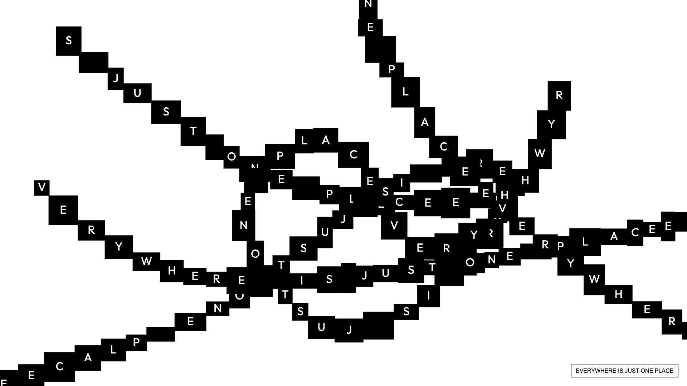

# type-spread

A generative typography experiment built with p5.js.

Rectangles spread across the canvas, each carrying a letter from a message. Each block scales in from the edge of the previous one, creating a chain that fills the screen with type.

## Features

- Click to restart the spread from a new origin point
- Type a custom message in the input field and press Enter to use it
- Optional animated color cycling across blocks (`CYCLE_FILL`)
- Responsive canvas that adapts to the container and window size
